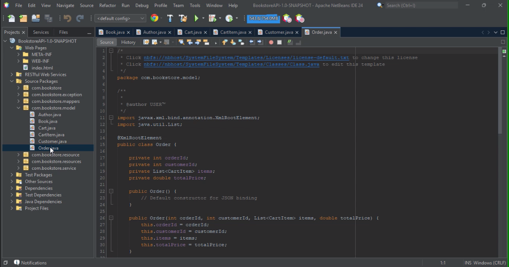

# 📚 Bookstore RESTful API

A comprehensive RESTful API for managing a bookstore system, developed using Java and JAX-RS (Jersey). This project is part of a coursework assignment for learning client-server architecture principles and building scalable web APIs with proper error handling, resource modeling, and request processing.

---

## 🎥 Demo Video

[](https://www.youtube.com/watch?v=jIiwV2VsR-I&t=51s)

> 📺 Click the image above to watch the full video demonstration

---

## 📌 Features

- Full CRUD operations for:
  - 📖 Books
  - ✍️ Authors
  - 👤 Customers
- 🛒 Shopping Cart management
- 📦 Order processing
- ✅ In-memory data storage (HashMap, ArrayList)
- 🛠️ Exception handling using `ExceptionMapper`
- 📬 JSON request/response body format
- 🔍 Tested using Postman

---

## 🧠 Learning Objectives

This project demonstrates:

- RESTful API design with HTTP methods (GET, POST, PUT, DELETE)
- Proper use of JAX-RS annotations (`@Path`, `@GET`, `@POST`, etc.)
- Structuring a modular Java API using layered architecture
- Custom exception handling with informative responses
- Simple e-commerce workflows: cart → order

---

## 🧱 Project Structure

```
BookstoreAPI/
├── pom.xml
├── src/
│   ├── main/
│   │   ├── java/
│   │   │   └── com/
│   │   │       └── bookstore/
│   │   │           ├── model/            # <-- Entity classes (Book, Author, Customer, etc.)
│   │   │           │   ├── Book.java
│   │   │           │   ├── Author.java
│   │   │           │   ├── Customer.java
│   │   │           │   ├── CartItem.java
│   │   │           │   ├── Cart.java
│   │   │           │   └── Order.java
│   │   │           ├── resource/         # <-- JAX-RS Resources (Endpoints)
│   │   │           │   ├── BookResource.java
│   │   │           │   ├── AuthorResource.java
│   │   │           │   ├── CustomerResource.java
│   │   │           │   ├── CartResource.java
│   │   │           │   └── OrderResource.java
│   │   │           ├── service/          # <-- Services (in-memory logic and storage)
│   │   │           │   ├── BookService.java
│   │   │           │   ├── AuthorService.java
│   │   │           │   ├── CustomerService.java
│   │   │           │   ├── CartService.java
│   │   │           │   └── OrderService.java
│   │   │           └── exception/        # <-- Custom Exceptions
│   │   │               ├── BookNotFoundException.java
│   │   │               ├── AuthorNotFoundException.java
│   │   │               ├── CustomerNotFoundException.java
│   │   │               ├── CartNotFoundException.java
│   │   │               ├── InvalidInputException.java
│   │   │               ├── OutOfStockException.java
│   │   │               └── mappers/     # <-- Exception Mappers
│   │   │                   ├── BookNotFoundExceptionMapper.java
│   │   │                   ├── AuthorNotFoundExceptionMapper.java
│   │   │                   ├── CustomerNotFoundExceptionMapper.java
│   │   │                   ├── CartNotFoundExceptionMapper.java
│   │   │                   ├── InvalidInputExceptionMapper.java
│   │   │                   └── OutOfStockExceptionMapper.java
│   └── webapp/
│       ├── WEB-INF/
│       │   └── web.xml
│       └── (optional: frontend assets if needed)
└── target/
    └── BookstoreAPI-1.0-SNAPSHOT.war
```
---

## 📌 API Endpoints Overview

### Books `/books`
- `POST /books` – Create new book
- `GET /books` – Get all books
- `GET /books/{id}` – Get a book by ID
- `PUT /books/{id}` – Update book
- `DELETE /books/{id}` – Delete book

### Authors `/authors`
- `POST /authors`
- `GET /authors`
- `GET /authors/{id}`
- `PUT /authors/{id}`
- `DELETE /authors/{id}`
- `GET /authors/{id}/books` – Get all books by author

### Customers `/customers`
- `POST /customers`
- `GET /customers`
- `GET /customers/{id}`
- `PUT /customers/{id}`
- `DELETE /customers/{id}`

### Cart `/customers/{customerId}/cart`
- `POST /items` – Add item to cart
- `GET /` – View cart
- `PUT /items/{bookId}` – Update item quantity
- `DELETE /items/{bookId}` – Remove item

### Orders `/customers/{customerId}/orders`
- `POST /` – Create order from cart
- `GET /` – View all orders
- `GET /{orderId}` – View specific order

---

## ❌ Custom Exceptions Handled

- `BookNotFoundException`
- `AuthorNotFoundException`
- `CustomerNotFoundException`
- `CartNotFoundException`
- `OutOfStockException`
- `InvalidInputException`

Each is mapped to proper HTTP status codes using `ExceptionMapper`.

---

## 🧪 Testing

All endpoints were tested using **Postman**, with both positive and negative scenarios, including:

- Validation errors (400 Bad Request)
- Resource not found (404 Not Found)
- Successful creations and deletions (201, 200, 204)

---

## 🔧 Tech Stack

- Java
- JAX-RS (Jersey)
- JSON
- Postman
- Maven

---

## 🚀 Getting Started

To run the API:

1. Clone this repository
2. Open in NetBeans or your favorite IDE
3. Run the project on a servlet container like Tomcat or GlassFish
4. Test the API using Postman

---

## 📄 License

This project is for educational purposes and coursework only.
